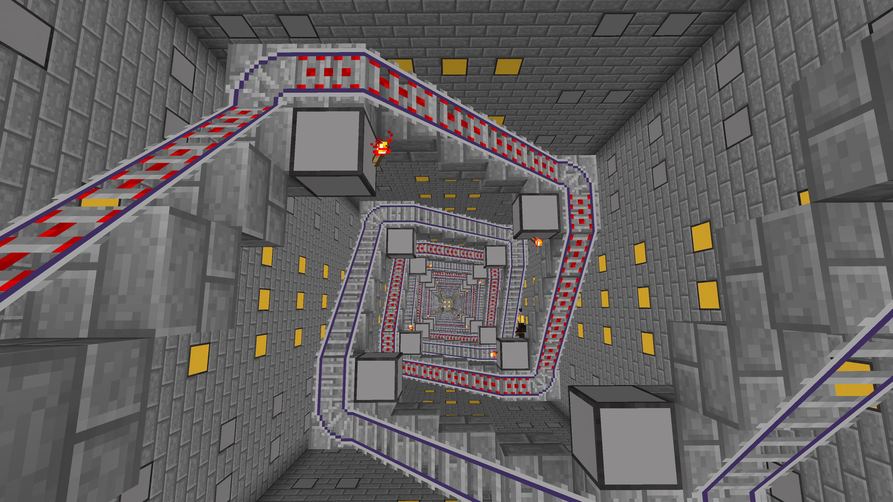
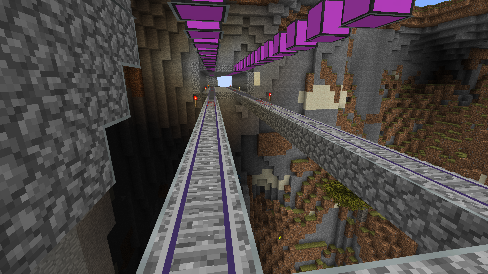
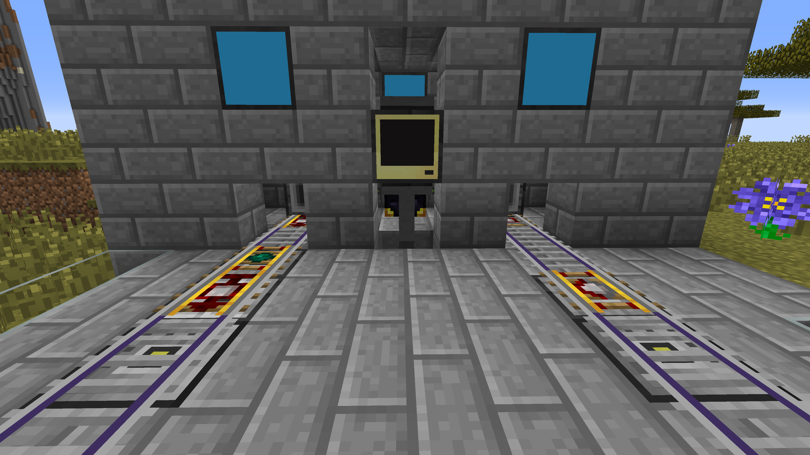
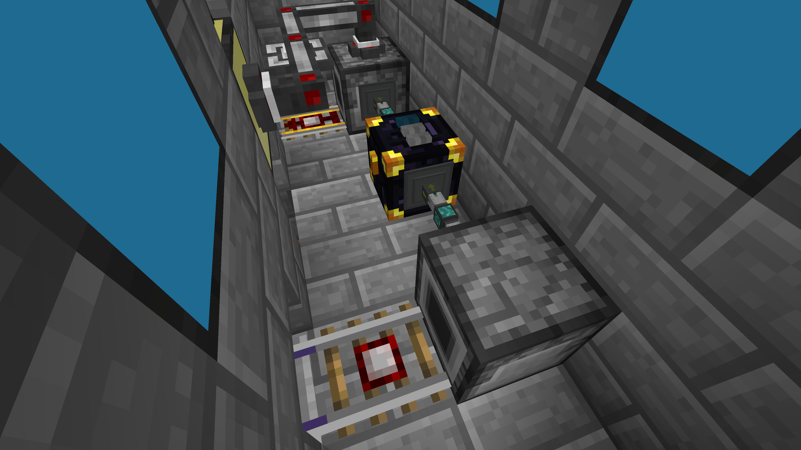
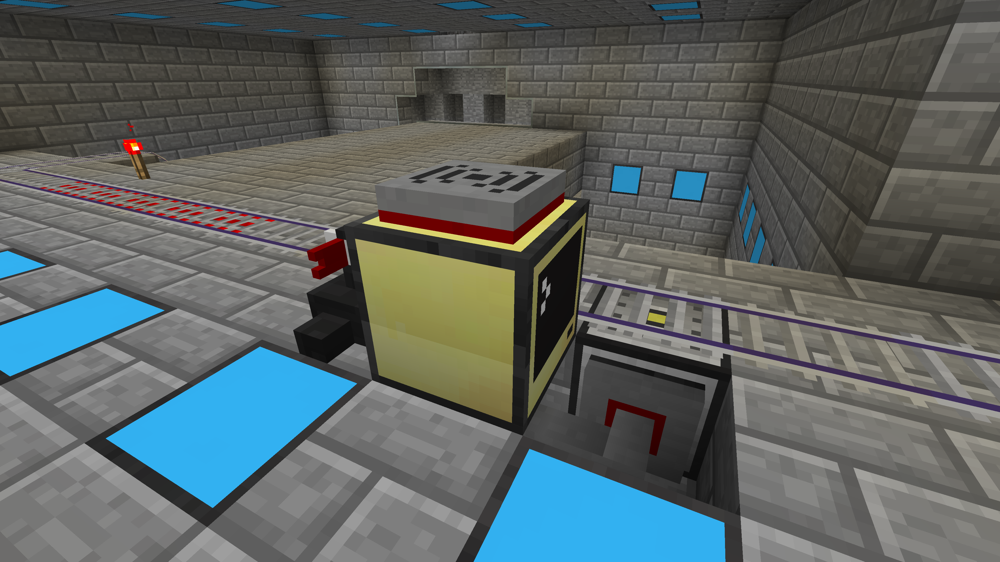
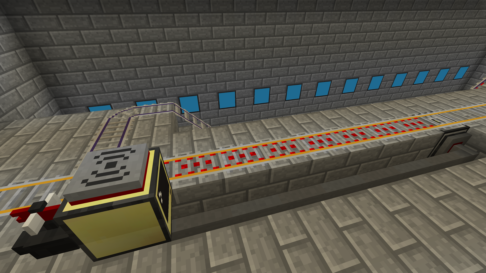
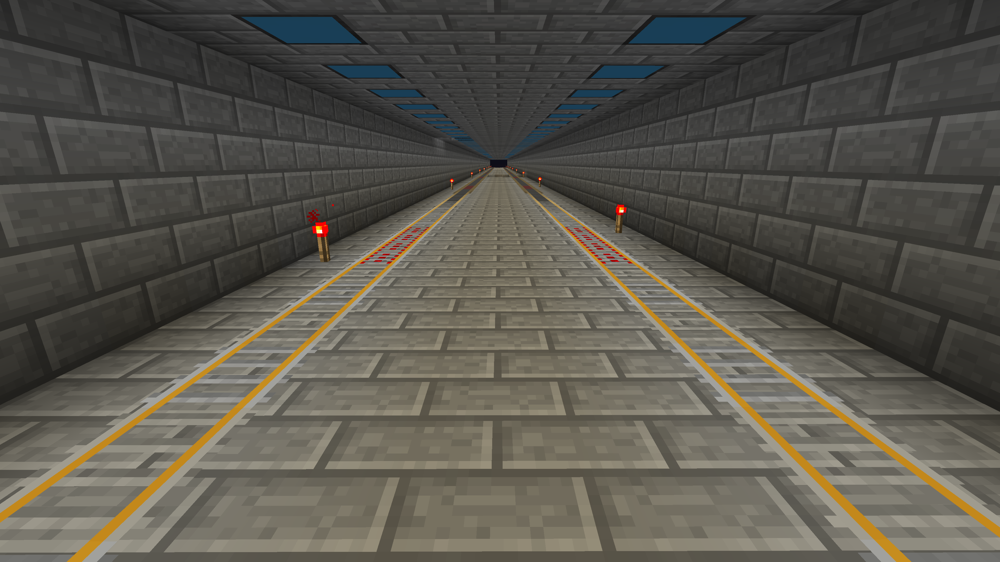

# prism-rails
Rail transport libraries based on the Prism ComputerCraft framework

The prism-rails packages enable you to build a rail network that can shuttle passengers and cargo across extreme distances with precise control. The routing system tracks each minecart as it makes its way across the network and when a minecart approaches a switch, sets the switch appropriately so that the minecart makes it to its desired destination.

## Requirements
Besides ComputerCraft itself, you'll need the following mods to build a functioning rail network:
* [Railcraft](http://www.railcraft.info/): This mod is used for its [Switch Tracks](http://railcraft.info/wiki/track:switch_tracks), [Switch Motors](http://railcraft.info/wiki/device:switch_motor), [Detectors](http://railcraft.info/wiki/device:detectors), [Embarking Tracks](http://railcraft.info/wiki/track:embarking_track), [Disembarking Tracks](http://railcraft.info/wiki/track:disembarking_track), [Locking Tracks](http://railcraft.info/wiki/track:locking_track), and [Cart Dispensers](http://railcraft.info/wiki/device:cart_dispenser).
* [Computronics](https://wiki.vexatos.com/wiki:computronics): This mod is used for its Digital Detectors.

The rail libraries have been tested on ComputerCraft 1.74, Railcraft 9.12.2.0, and Computronics 1.7.10-1.6.0 all running on Minecraft 1.7.10, but it is quite possible that everything will work on earlier or later versions of Minecart and these mods, provided that the items listed above are working correctly.

## Getting started
A basic rail network starts with a computer running the `railrouter` server. That is the only absolutely essential component for a functional network, but it isn't a very interesting network until you add:
1. [Stations](#stations), each with a computer running the `railstation` server
2. [Switches](#switches), each with a computer running the `railswitch` server
3. [Minecarts](#minecarts), each with a unique name

The rail libraries assume that you have wireless connectivity between your router and your switches and stations. If some of your switches and stations are at a [considerable distance](http://computercraft.info/wiki/Rednet_(API)#Range) from your router (which is likely in larger rail networks), you'll need to either:
1. Use [Ender Modems](http://www.computercraft.info/wiki/Ender_Modem) rather than [Wireless Modems](http://www.computercraft.info/wiki/Wireless_Modem) if they are supported in the version of ComputerCraft you are using;
2. Set up one or more [Rednet repeaters](http://www.computercraft.info/wiki/Repeat); or
3. Modify your [ComputerCraft configuration](http://computercraft.info/wiki/ComputerCraft.cfg) to allow wireless communication over longer distances.

It is necessary for the router to be online at all times; on larger rail networks, you'll want to ensure this by e.g. placing a chunk loader from the mod of your choice nearby the `railrouter` server. However, it is not necessary for any of the stations or switches to be online continuously; placing chunk loaders near stations and switches is not required.

## Basic concepts
A rail network is organized into named _lines_, e.g. blue, red, express, etc. A _location_ within the rail network is expressed as a position on a line, optionally with a direction (`-1` or `1`) indicating the direction of travel, e.g. `{line = "blue", position = 500, direction = 1}`.

Positions on lines are arbitrary and do not need to correspond to GPS coordinates. The only requirement is that the ordering of positions on a line matches the ordering of those tracks in the world; so if there is a minecart at position 500 on the blue line traveling in the positive (`1`) direction, it should pass through position 600 before it passes through position 700 in the world.

## Router
The `railrouter` server acts as the core of the rail network, receiving requests from stations and issuing commands to switches. To set up a router:
1. Place a computer and attach a [Wireless Modem](http://www.computercraft.info/wiki/Wireless_Modem).
2. [Install Amber](https://github.com/danports/amber#getting-started).
3. Add the `prism-rails` repository (or, if you are running an [Amber server](https://github.com/danports/amber#server), add the repository there instead to make it available to all of the computers in your network): `> amber repository add https://github.com/danports/prism-rails`
4. Install the `railrouter` package: `> amber install railrouter`
5. An editor will open with a blank configuration file; exit the editor to complete the installation.
6. Reboot. After the computer restarts, it will display `RailRouterOS: Listening on top...` (or whatever the location of your wireless modem is).

That's it! Now you're ready to add stations and switches to your network.

## Stations
The `railstation` package provides an interface for players to interact with the rail network and request departures to locations in the network. To set up a new station:
1. Place a computer and attach a [Wireless Modem](http://www.computercraft.info/wiki/Wireless_Modem).
2. Place two [Cart Dispensers](http://railcraft.info/wiki/device:cart_dispenser) near the computer, one for incoming minecarts and one for outgoing minecarts, and configure them:
   1. Place BuildCraft Pipes or EnderIO Item Conduits (depending on the mods you have available) between the two dispensers to shuttle incoming minecarts into the outgoing dispenser. You could also place an Ender Chest or similar device with a suitable supply of minecarts between the incoming and outgoing dispensers; this will ensure that the station never runs out of fresh minecarts.
   2. Place a [Detector Track](https://minecraft.gamepedia.com/Detector_Rail) directly in front of the incoming Cart Dispenser. This will enable the dispenser to automatically pick up incoming minecarts and place them into its inventory.
   3. Place a [Locking Track](http://railcraft.info/wiki/track:locking_track) set to boarding mode directly in front of the outgoing Cart Dispenser. This track will get newly dispensed minecarts moving.
3. On the ongoing line, place the following in order, starting with the items closest to the Cart Dispenser:
   1. An [Any Detector](http://railcraft.info/wiki/device:detectors) with an [Embarking Track](http://railcraft.info/wiki/track:embarking_track) on top, which will pull the player requesting a departure into the departing minecart.
   2. A [Player Detector](http://railcraft.info/wiki/device:detectors) with a [Locking Track](http://railcraft.info/wiki/track:locking_track) set to boarding mode on top, which will ensure that minecarts will only leave the station if there is a player on board.
   3. A Digital Detector with any track on top to detect outgoing minecarts.
4. On the incoming line, place the following in order, starting with the items closest to the Cart Dispenser:
   1. An [Any Detector](http://railcraft.info/wiki/device:detectors) with a [Disembarking Track](http://railcraft.info/wiki/track:disembarking_track) on top, which will kick anyone or anything out of the minecart when it arrives at the station.
   2. A Digital Detector with any track on top to detect incoming minecarts.
5. Connect the computer to the outgoing Cart Dispenser _and_ adjacent Locking Track with redstone dust, rednet cable (Minefactory Reloaded), or any other redstone conductor of your choosing.
6. Connect the two Digital Detectors to the station computer with some [Wired Modems](http://www.computercraft.info/wiki/Wired_Modem) and [Networking Cable](http://www.computercraft.info/wiki/Networking_Cable). Make sure to right-click the Wired Modems attached to the detectors to activate them when finished. Note the identifiers assigned to the detectors (e.g. `digital_detector_27`); you'll need them in the next step.
7. Set up the station computer:
   1. [Install Amber](https://github.com/danports/amber#getting-started) on the station computer.
   2. Add the `prism-rails` repository (or, if you are running an [Amber server](https://github.com/danports/amber#server), add the repository there instead to make it available to all of the computers in your network): `> amber repository add https://github.com/danports/prism-rails`
   3. Install the `railstation` package: `> amber install railstation`
   4. An editor will open with a configuration file; update the necessary values and then save the file and exit the editor:
      1. Set `stationId`. Generally, stations should be numbered sequentially, starting with `1`.
      2. Set `stationName` to whatever you'd like.
      3. Set `cartsIn.detector` to the identifier assigned to the incoming minecart Digital Detector.
      4. Set `cartsIn.location` to the location of the station on the incoming line.
      5. Set `cartsOut.detector` to the identifier assigned to the outgoing minecart Digital Detector.
      6. Set `cartsOut.dispenser.side` to the side of the computer attached to the outgoing Cart Dispenser via redstone.
      7. Set `cartsOut.location` to the location of the station on the outgoing line.
   5. Reboot. After the computer restarts, it will display `RailStationOS: Listening on top...` (or whatever the location of your wireless modem is).

When you are finished, your station should look something like this on the outside (the outgoing line is on the left and the incoming line on the right):

And something like this on the inside:

To use a station computer once configured, simply walk up to it and follow the instructions on the screen to request a departure to the station or location of your choice.

### Pocket stations
You can install `railstation` on a pocket computer if you want to request a departure for a named minecraft in your inventory. This can be useful if you want to visit portions of your rail network that are under construction, in which you have not yet built stations. To do so:
1. Craft a [Pocket Computer](http://computercraft.info/wiki/Pocket_Computer) with a [Wireless Modem](http://www.computercraft.info/wiki/Wireless_Modem).
2. [Install Amber](https://github.com/danports/amber#getting-started).
3. Add the `prism-rails` repository (or, if you are running an [Amber server](https://github.com/danports/amber#server), add the repository there instead to make it available to all of the computers in your network): `> amber repository add https://github.com/danports/prism-rails`
4. Install the `railstation` package: `> amber install railstation`
5. Delete `stationId` and `stationName` from the configuration file and set `cartsOut.minecartName` to the name of the minecart in your inventory. Save the file and exit the editor to complete the installation.
6. Reboot. After the computer restarts, it will display `RailStationOS: Listening on back...`.

## Switches
Computers running the `railswitch` package are responsible for detecting incoming minecarts, relaying that information to the router, and responding to the router's commands to set the state of the switch motor to which they are connected. To set up a new switch:
1. Place a computer and attach a [Wireless Modem](http://www.computercraft.info/wiki/Wireless_Modem).
2. Place a [Switch Motor](http://railcraft.info/wiki/device:switch_motor) adjacent to the [Switch Track](http://railcraft.info/wiki/track:switch_tracks) and the computer. (You can also place the Switch Motor at some distance from the computer and connect it to the computer with a redstone conductor.)
3. Place a Digital Detector under one of the tracks approaching the Switch Track and connect it to the computer with [Wired Modems](http://www.computercraft.info/wiki/Wired_Modem) and [Networking Cable](http://www.computercraft.info/wiki/Networking_Cable). Make sure to right-click the Wired Modem attached to the detector to activate it when finished.
4. Set up the switch computer:
   1. [Install Amber](https://github.com/danports/amber#getting-started) on the switch computer.
   2. Add the `prism-rails` repository (or, if you are running an [Amber server](https://github.com/danports/amber#server), add the repository there instead to make it available to all of the computers in your network): `> amber repository add https://github.com/danports/prism-rails`
   3. Install the `railswitch` package: `> amber install railswitch`
   4. An editor will open with a configuration file; update the necessary values and then save the file and exit the editor:
      1. Set `switchId`. Generally, switches should be numbered sequentially, starting with `1`.
      2. Set `location` to the location of the switch on the main (incoming) line.
      3. If the track continues onto a different line after the switch (i.e. the current line ends after this switch), set `continuesTo` to the location the track continues onto and comment out or delete `location.direction`.
      4. Set `divergesTo` to the location the track diverges to when the Switch Motor is activated.
      5. Set `switch.side` to the side of the computer the Switch Motor is attached to.
      6. If necessary, set `slowTrack.side` to the side of the computer that should emit a redstone signal only when the switch is not activated. This can be used to slow down minecarts on [High Speed Tracks](http://railcraft.info/wiki/track_type:hs) before they take the diverging line.
   5. Reboot. After the computer restarts, it will display `RailStationOS: Listening on top...` (or whatever the location of your Wireless Modem is).

When you are done, your switch should look something like this on a normal track:

And something like this on a High Speed Track:

## Minecarts
Because the rail network relies on the names of minecarts to route them to their destinations, all minecarts used on the network should have unique names. You can set the names for your minecarts using an [Anvil](https://minecraft.gamepedia.com/Anvil).

## Questions? Problems?

[Open an issue](https://github.com/danports/prism-rails/issues/new) and let us know how we can help.

Happy travels!

